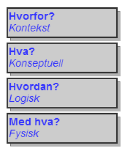
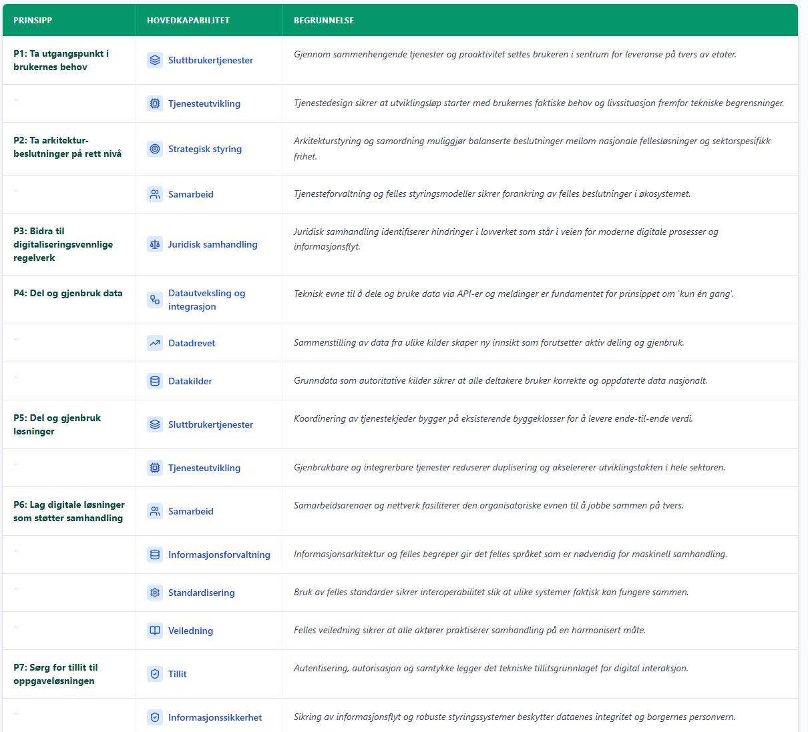
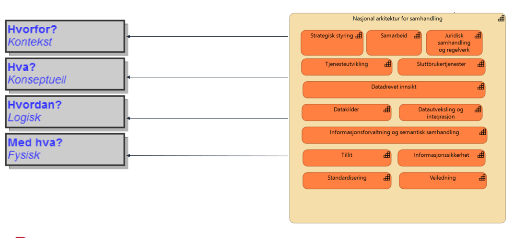
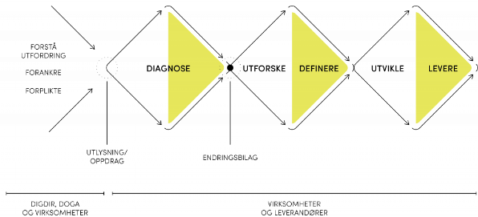

## Mal for arkitekturvurderinger – utkast

**NB!** Generelt rundt bruken av malen: Man trenger ikke bruke ALT i malen, men benytt den som et utgangspunkt og velg ut det som er mest relevant. Det viktigste er at man har et bevisst forhold til hva man velger å beskrive. Beskrivelsen vil utvikle seg gjennom utviklingsprosessen.

## Utkast til mal – overordnet struktur

**Kontekstuell – Hvorfor** – Setter rammen for arkitekturen. Hjelper til å avgrense og beskrive kontekst. Beskriver bakgrunnen og utgangspunkt, som for eksempel mål og drivere, viktige prinsipper (IT-prinsipper), strategier, føringer og forutsetninger. Visjon og omfang av det som skal lages.

**Konseptuell – Hva** – Definerer hva som skal lages. Her beskrives egenskapene til løsningene, dvs. hvilke krav som stilles. Krav og målsetting utdypes og detaljeres. Alle deler av mål og omfang dekkes uten at realisering beskrives. Krav og egenskaper beskrives bl.a. i form av hvilke tjenester det er behov for.

**Logisk – Hvordan** – Beskriver den logiske strukturen. Her beskrives hvordan kravene og egenskapene løses. Dette gjøres ved å gruppere tjenestene til logiske komponenter. Den «ideelle» løsningen utforskes uten at implementasjon er en del av vurderingen. Flere alternative løsninger vurderes for å teste ut ulike prioriteringer og konsekvenser av de alternative forslagene.

**Fysisk – Med hva** – Beskrivelse av hvordan den planlagte strukturen er tenkt å realiseres. Her beskrives de fysiske løsningene, dvs. hvilke konkrete (fysiske) komponenter (systemer, programvare), hvilken teknologi (programmeringsspråk), arkitekturmønstre, produkter etc. som er valgt for å realisere de logiske komponentene. Standarder og mønstre brukes til hjelp for å definere løsningen. I tillegg kommer føringer fra kjøretidsplattformene og retningslinjer for utvikling. Forskjellige løsningsalternativer vurderes.

### Bakgrunn (hvorfor) – Kontekstuelt nivå

Interessenter, mål og drivere, rammebetingelser, forutsetninger (strategier, prinsipper og dagens utfordringer som valg av ny arkitektur/teknologi skal løse). Spesielt relevant er typisk de overordnete arkitekturprinsipper (og hvilke kapabiliteter som trengs).

- Mål og føringer
  - Prinsipper og føringer
  - Felles økosystem
    - Overordnete arkitekturprinsipper for digitalisering i offentlig sektor
    - Nasjonal Arkitektur kapabiliteter
  - Andre føringer for arkitekturvalg

### Behov (hva)

- Drømmereisen (se Miro)

Her defineres kriteriene som alternativene skal vurderes mot. Kriteriene deles inn i tre typer:

- Funksjonelle behov
  - Spesifikke evner tjenesten må ha for å levere verdi til sluttbrukeren
- Evt. ikke-funksjonelle krav
  - Ytelse, volum, sikkerhet, …
- Overordnete arkitekturprinsipper for digitalisering i offentlig sektor
- Relevante kapabiliteter (Nasjonal Arkitektur)
  - Identifiser hvilke nasjonale kapabiliteter som er kritiske for dette valget

### Konseptuell arkitektur

- Definer høynivå-alternativer uavhengig av teknologi
  - Skal knyttes opp mot de relevante kriteriene for valg av alternativ
    - (Se under «Behov» over)
- Konseptuelle alternativer, f.eks. knyttet til:
  - Mønster: Beskriv overordnet arkitekturstil (f.eks. distribuert vs. sentralisert, hendelsesdrevet vs. forespørsel-respons)
  - Monolitt vs. mikrotjenester
  - Datasentrisk tjenesteutvikling
  - Felles informasjonsmodeller – ulike måter å gjøre dette på
  - Felles økosystem, …
- Vurderinger av alternativene opp mot hverandre
  - Resultat: Konseptuelt IT-målbilde for løsningen
  - Utgangspunkt for løsningsvalgene

### Applikasjonsarkitektur (logisk og fysisk)

- Logisk design (hvordan): Her beskrives en logisk gruppering av behovene i funksjonelle komponenter – skal være teknologi-uavhengig.
- Implementering (med hva)
- Løsningsalternativer
- Vurdering av løsningsalternativ
  - Alternative løsningsvalg må beskrives og vurderes opp mot hverandre
    - Kriterier med +/- metode
- Anbefalt løsning
- Pilot/POC
  - Bør baseres på et valgt konsept
  - Hva ønsker man å få ut av dette?
  - Må settes i sammenheng med mål, behov, prinsipper
  - Bør følge samme mal, men trenger ikke fylle inn alt av innhold

---

**Til diskusjon:**

- Hvor dypt ned i arkitekturstyring skal dokumentet beskrive? F.eks. forvaltningskost, overføring linje, …
- Føringer må inn (arkitekturprinsippene ⇒ NA-kap)
- Ang. prinsippene under:
  - Vi ønsker at for hvert løsningsalternativ skal disse angi «i hvilken grad» kapabilitetene trenges (støttes eller realiseres). «I hvilken grad» er en egenfastsettelse på «0, NA, 1 = i liten grad, 2 = i stor grad, 3 = i meget stor grad»
- Prinsippene må lenkes til. Kapabilitetene må forklares «litt til». Lenke til hele kapabilitetsmodellen. Underkapabiliteter må inn i oversikten.
- Andre arkitekturmønstre som skal inn og argumenterer for?
  - Hendelsesdrevet og tjenestekjeder

**Områder som bør inn i dokumentet:**

- Forretningsmål som skal støttes (hentes fra egen prosess evt.), kjente behov etc.
- Arkitekturmålbilde
- Løsningsarkitektur

**NB!** Må se alternativvurderinger i lys av hvor man er i en utviklingsprosess.

- For hvert løsningsalternativ som skal vurderes kan disse være på ulike abstraksjonsnivåer.
- Hensikten med å dele opp en arkitekturbeskrivelse på denne måten er å strukturere argumentasjonen rundt arkitektoniske valg og beslutninger, slik at man lettere kan skille på hva som er relevant for en gitt problemstilling og hvorfor man har truffet de valg som ble tatt.

## Vedlegg A: Foreløpige notater om arkitekturstyring

### Plan for operasjonalisering av arkitekturstyring

1. Det etableres en rolle som ansvarlig arkitekt for hver pilot.
2. Det etableres en rolle som «sjefsarkitekt» for leveransene fra prosjektet, som f.eks. målarkitektur, mønstre og arkitekturrammeverk.
3. Det etableres en mal for vurderinger som må gjøres før og under etablering av piloter. Malen skal videreutvikles gjennom bruk i pilotene og er en del av hovedleveransen «rammeverk».
4. Det etableres et arkitekturråd som består av representanter fra alle virksomhetene og vurderer arkitekturvalgene som er gjort (dokumentert i henhold til malen).
5. Arkitekturvurderingene skal legges fram for arkitekturrådet ved oppstart/avslutning av hver sprint.
6. Malen legges inn på prosjektets dokumentasjonsside «SAMT-BU Docs», og fylles inn der. Malen er «dynamisk» og blir mer komplett utfylt gjennom utviklingsprosessen.
7. Arkitekturvalg gjort i pilotene blir evaluert og inngår i den overordnede arkitekturleveransen fra prosjektet.

### Noen detaljer

- Roller og ansvar (må defineres)
  - «Ansvarlig arkitekt» – ansvar for helhet. Taktisk.
    - Sørge for at IT-målbilder, veikart og løsningsmønstre blir utarbeidet på en hensiktsmessig måte
    - Sørge for at løsningsarkitektur er i henhold til måloppnåelsen
  - Teamarkitekt/Løsningsarkitekt: Operativt
- Metodikk…
